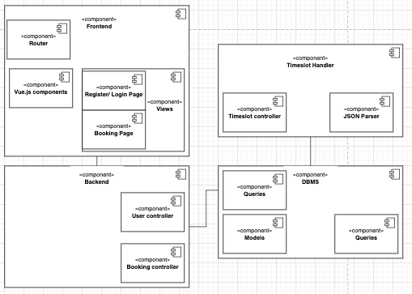
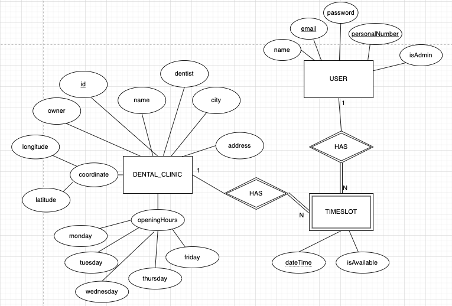

# Team-3 Project

A service that allows residents of Gothenburg to book dentist appointments

## Table of contents

* [Introduction](#introduction)
  * [How to install](#how-to-intstall)
* [Technologies and Overview](#technologies-and-overview)
* [Requirements and Drivers](#requirements-and-drivers)
* [Versions](#versions)
* [Roles](#roles)

## Introduction

This is a documentation repository that is part of a bigger dentist appointment system.
The projet is a school assignment implemented by 6 students from the University of Gothenburg.

### How to install

To run this system you will need to clone these four repositories and follow the instruction in the respective readme files

```
git clone https://git.chalmers.se/courses/dit355/test-teams-formation/team-3/booking-handler.git
git clone https://git.chalmers.se/courses/dit355/test-teams-formation/team-3/team-3-documentation.git
git clone https://git.chalmers.se/courses/dit355/test-teams-formation/team-3/frontend.git
git clone https://git.chalmers.se/courses/dit355/test-teams-formation/team-3/frontend.git
```

## Technologies and Overview

The project is composed of four entities (as shown below) as a distributed System. Each components have a self-contained separate repository.
The communication between the components are done with either an Api or through a mqtt broker. The frontend "talks" with the backend through an Api and
the communtication between the Backend, DBMS and Timeslot handler are made possible with a mqtt broker.



### Frontend
The frontend is built with the Vue framework. One of the key features is a map generated by the Leaflet API and based on Open Street Maps. The dentists' locations are shown on the map. Our API sends the coordinates of the dentist sites, which are then dynamically shown on the map. The frontend also enables for the scheduling of dental appointments. The languages used for the frontend is HTML, CSS and javascript.

### Backend
The REST api is built with the express framework. It is connected cross domain to the frontend, which means they are running on different ports. The data exchanged between the two components are made possible through HTTP request and responses. Most of the data is contained as a JSON object in the HTTP body, and some as parameters in the URL. Also a cookie is sent in the HTTP header when the /login endpoint is called and the request is successfull. Furthermore the API is connected to our database as described under DBMS, but the backend only handles the user table. MQTT is also used for subscribing and publishing timeslots that we recive from the DBMS. The amount of data sent can be large, so to handle all requests the backend reads a batch of 10 before processing more. The backend uses QoS 2 as it is key functionallity for the system to display the right timeslots, aswell as for the time bookings from the user.

### Timeslot Handler
The timeslot handler scans through the JSON file from [this link](https://raw.githubusercontent.com/feldob/dit355_2020/master/dentists.json) and publishes each dentist clinic as a its own JSON object to the database. The timeslot handler also grabs the opening hours for each day of the week, and creates 30 minute increments out of them, a timeslot. It skips lunchtime (12.00-13.00). Each timeslot is published as well to the database, whereas the database will handle which timeslot belongs to which clinic. 
The order of publishing goes as follows: clinic is published, then it waits for the response back from the database, then the timeslots are published.


### DBMS
The DBMS connects to the cluster OralFixation on the cloud using mongodb and mongoose for declaration of schemas. 
It currently uses mqtt locally for communication with the Timeslot Handler and to receive the timeslots to insert in the database.


Regarding the database, the structure and relations of the tables can be seen below.



## Requirements and Drivers

Examples of some of the requirements we are/where working by:

* The system shall provide functionality for booking dentist appointments
* The user interface should show available times to users.
* The system shall provide a message if a booking was successful or unsuccessful
* The system shall contain a map that displays dentist clinics and can be navigated
* The user interface shall react to responses with appropriate  messaging
* The system shall visualise the supply/available slots for appointment

Our drivers are:

* Reliability
* Usability

To have a timeslot not showing up, or the booking not going through. That kind of system would prove very unstable and almost unusable. To guarantee that such situations were avoided, we used QoS level 2 to ensure that the MQTT message was received. The disadvantage may be a somewhat slower system, but it is a trade-off we felt was required.

## Versions

For more detailed information, visit each repo and check under tags. There should be a tag for each release.

Version 1 or V1 was finished Dec 1 2021. It contained a simple GUI that was connected to the Backend Api. A first draft of the db tables and a connection to the DBMS.
Also a way to parse a dentist registry JSON file to usefull information that will be used through out the system.

Version 2 or V2...

## Roles

|Role|Name|Email|
|----|-----|-------|
|Scrum Master|Richard Novenius|gusnovri@student.gu.se|
|Product Owner|Edvin Danielsson|gusdanieed@student.gu.se|
|Teach Lead|Felix Mertala|gusmertfe@student.gu.se|
|Head of Documentation|Carl Andreasson|gusandcafg@student.gu.se|
|Public Relations|Marcus Andersson|gusqanuqma@student.gu.se|
|Developer|Adam Frison|gusfrisoad@student.gu.se|
