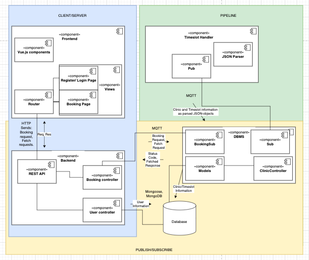

# Team-3 Project

A service that allows residents of Gothenburg to book dentist appointments

## Table of contents

* [Introduction](#introduction)
  * [How to install](#how-to-intstall)
* [Technologies and Overview](#technologies-and-overview)
* [Reqierments and Drivers](#reqierments-and-drivers)
* [Versions](#versions)
* [Roles](#roles)

## Introduction

This is a documentation repository that is part of a bigger dentist appointment system.
The projet is a school assignment implemented by 6 students from the University of Gothenburg.

### How to install

To run this system you will need to clone these four repositories and follow the instruction in the respective readme files

```
git clone https://git.chalmers.se/courses/dit355/test-teams-formation/team-3/booking-handler.git
git clone https://git.chalmers.se/courses/dit355/test-teams-formation/team-3/team-3-documentation.git
git clone https://git.chalmers.se/courses/dit355/test-teams-formation/team-3/frontend.git
git clone https://git.chalmers.se/courses/dit355/test-teams-formation/team-3/frontend.git
```

## Technologies and Overview

The project is composed of four entities (as shown below) as a distributed System. Each components have a self-contained separate repository.
The communication between the components are done with either an Api or through a mqtt broker. The frontend "talks" with the backend through an Api and
the communtication between the Backend, DBMS and Timeslot handler are made possible with a mqtt broker.



### Frontend

### Backend

### DBMS

### Timeslot Handler

Regarding the database, the structure and relations of the tables can be seen below.


## Requierments and Drivers

Examples of some of the requirements we are/where working by:

* The system shall provide functionality for booking dentist appointments
* The user interface should show available times to users.
* The system shall provide a message if a booking was successful or unsuccessful
* The system shall contain a map that displays dentist clinics and can be navigated
* The user interface shall react to responses with appropriate  messaging
* The system shall visualise the supply/available slots for appointment

Our drivers are:

* Reliability
* Usability

## Versions

For more detailed information, visit each repo and check under tags. There should be a tag for each release.

Version 1 or V1 was finished Dec 1 2021. It contained a simple GUI that was connected to the Backend Api. A first draft of the db tables and a connection to the DBMS.
Also a way to parse a dentist registry JSON file to usefull information that will be used through out the system.

Version 2 or V2...

## Roles

|Role|Name|Email|
|----|-----|-------|
|Scrum Master|Richard Novenius|gusnovri@student.gu.se|
|Product Owner|Edvin Danielsson|gusdanieed@student.gu.se|
|Teach Lead|Felix Mertala|gusmertfe@student.gu.se|
|Head of Documentation|Carl Andreasson|gusandcafg@student.gu.se|
|Public Relations|Marcus Andersson|gusqanuqma@student.gu.se|
|Developer|Adam Frison|gusfrisoad@student.gu.se|
